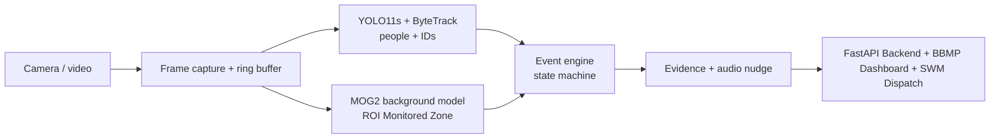
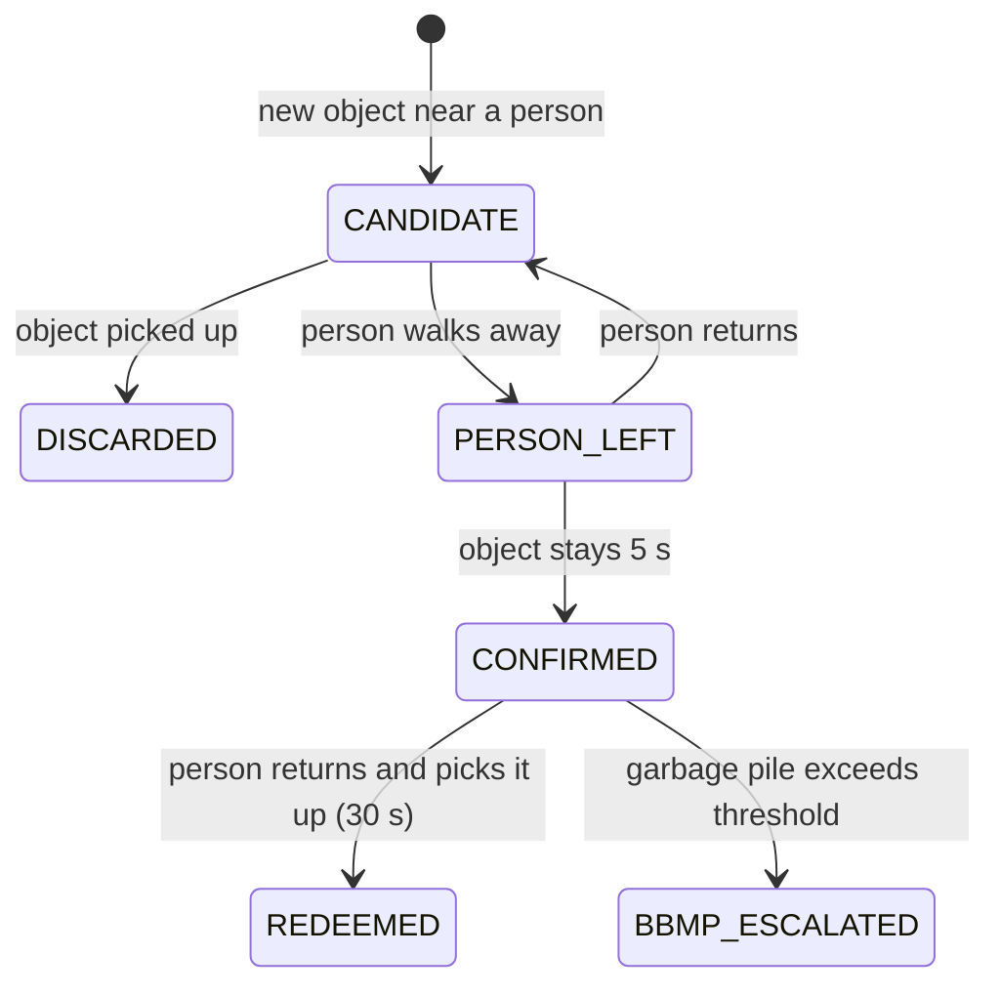

# CleanLoop

**AI littering prevention for municipal public spaces & BBMP black spots: Detect -> Nudge -> Redeem -> Clean -> Learn.**

CleanLoop watches a camera feed, detects when a person leaves an object on the ground and walks away, and responds in real time with a polite spoken reminder. If the person comes back and picks it up, the incident is marked **REDEEMED**. If a large pile forms at a designated black spot, it triggers an automated call/SMS alert to **BBMP Solid Waste Management (SWM) & Marshals** for rapid cleanup dispatch.

No face recognition. No identity lookup. People are only ever "Person_12" for a few seconds.

---

## Why CleanLoop is different for BBMP Municipal Cleanliness

Existing AI litter cameras mostly target drivers and exist to issue fines. CleanLoop focuses on **pedestrian littering**, **BBMP Ward black spots**, and **prevention**:

| | Typical systems | CleanLoop (BBMP Edition) |
|---|---|---|
| Response | Evidence for fines | Real-time audio nudge + BBMP SWM Automated Dispatch |
| Key metric | Offences caught | **Redemption rate**: how many people fix it when reminded |
| Detection | Needs a model trained on litter classes | **Class-agnostic + ROI Monitored Zone**: catches any dropped item |
| Municipal Integration | None | **BBMP Ward Leaderboard & Automated SWM Call Alert** |
| Privacy | Number plates / identity | Temporary IDs, no faces, auto-deleted evidence |

---

## How it works



1. **Track people.** YOLO11s detects people; ByteTrack gives each a temporary ID and we keep a short trail of where they walked.
2. **Find new objects.** A slow-learning background model (MOG2) spots anything new that appears in the **Monitored Target Zone** and stays still. Areas covered by people are ignored.
3. **Person-Origin Filtering.** Only items originating from a person's path/foot location are tracked, completely ignoring random background noise and furniture.
4. **Decide with a state machine.** Each new object is linked to the person whose path came closest:



5. **Respond & Dispatch.** On confirmation: spoken reminder, annotated snapshot, ~10s clip, and if a black spot pile accumulates, an **automated voice call/SMS alert to BBMP SWM & Marshals (+91-80-22660000)**.

---

## Tech stack

- **Vision:** Python, OpenCV, Ultralytics YOLO11s, ByteTrack, MOG2
- **Audio:** pyttsx3 (offline text-to-speech)
- **Backend:** FastAPI, SQLite, WebSockets, Twilio Voice API
- **Frontend:** Glassmorphism Web Dashboard & BBMP Ward Leaderboard

Runs on a normal laptop CPU (~10+ FPS at 1280 px); uses an NVIDIA GPU automatically if available.

---

## Getting started

Requires Python 3.10+ and git.

```powershell
git clone https://github.com/samartthhiregoudar-droid/cleanloop.git
cd cleanloop
python -m venv .venv
.venv\Scripts\activate          # Mac/Linux: source .venv/bin/activate
pip install -r requirements.txt
python create_structure.py
python check_setup.py
```

### Run Vision Pipeline

```powershell
python run_vision.py                        # webcam (source in config.yaml)
python run_vision.py eval/videos/demo.mp4   # a recorded video
python run_vision.py rtsp://user:pass@IP:554/stream   # an IP / CCTV camera
```

Keys: **F** full-screen toggle, **Q** quit, **R** reset background model, **M** toggle motion mask.

### Run Backend API & BBMP Dashboard

```powershell
uvicorn backend.main:app --reload --port 8000
```

- **BBMP Dashboard & Ward Leaderboard:** `http://localhost:8000/dashboard/`
- **Interactive OpenAPI Specs:** `http://localhost:8000/docs`

### Tests & Performance Evaluation

```powershell
# Run full unit test suite (15 tests)
python -m pytest tests -v

# Run precision / recall / F1 performance evaluation
python eval/evaluate.py
```

---

## Configuration

All thresholds live in `config.yaml`, so tuning never needs code changes.

| Setting | Default | Meaning |
|---|---|---|
| `camera.source` | `0` | Webcam index, video path, or RTSP URL |
| `static_objects.min_blob_area_px` | 500 | Ignore changes smaller than this |
| `static_objects.require_person_origin` | true | Only track items dropped/thrown by people |
| `static_objects.target_zone_roi` | [0.2, 0.0, 1.0, 1.0] | Monitored ground zone coordinates |
| `bbmp_escalation.phone_number` | `+91-80-22660000` | BBMP Control Room / SWM Hotline |
| `bbmp_escalation.pile_area_threshold_px` | 12000 | Pile size triggering BBMP call dispatch |

---

## Project structure

```
cleanloop/
  config.yaml            all thresholds and settings
  run_vision.py          main entry point
  check_setup.py         setup and hardware verification
  create_structure.py    directory setup script
  vision/
    capture.py           webcam / file / RTSP input, reconnect, ring buffer
    detector.py          YOLO wrapper (crop resizing for high accuracy)
    tracker.py           per-person movement history & occlusion trajectory correlation
    static_objects.py    new-object detection & ROI target zone filter
    dispatch.py          BBMP SWM & Marshals automated call/SMS dispatcher
    event_engine.py      littering state machine
    evidence.py          snapshots, clips, incident records, retention
    nudge.py             spoken reminder and thank-you audio TTS
    pipeline.py          wires vision, event engine, BBMP dispatch, and storage
    visualize.py         drawing helpers & ROI overlay
  backend/
    main.py              FastAPI server & WebSockets
    database.py          SQLite persistence, analytics & BBMP Ward Leaderboard
  frontend/
    index.html           glassmorphism dashboard & Ward Leaderboard UI
  tests/                 unit test suite (15 tests)
  eval/                  evaluation script and benchmark videos
  storage/               evidence snapshots, clips, and DB output (not committed)
```

---

## Team

Built for a hackathon, October 2026.
