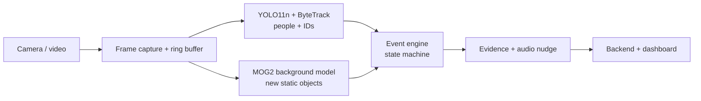
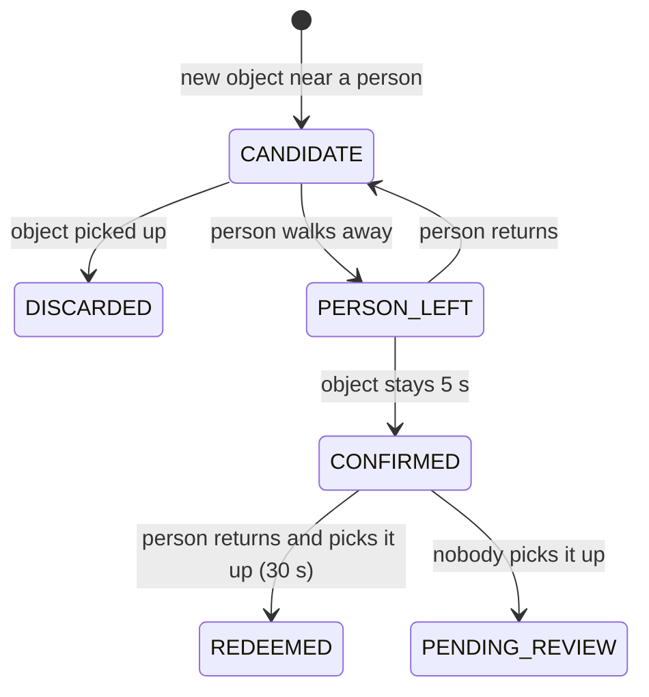

# CleanLoop

**AI littering prevention for any CCTV camera: Detect -> Nudge -> Redeem -> Clean -> Learn.**

CleanLoop watches a camera feed, detects when a person leaves an object on the ground and walks away, and responds in real time with a polite spoken reminder. If the person comes back and picks it up, the incident is marked **REDEEMED**. Every other incident is saved with a snapshot and short video clip for human review.

No face recognition. No identity lookup. People are only ever "Person_12" for a few seconds.

---

## Why CleanLoop is different

Existing AI litter cameras mostly target drivers and exist to issue fines. CleanLoop focuses on **pedestrian littering** and **prevention**:

| | Typical systems | CleanLoop |
|---|---|---|
| Response | Evidence for fines | Real-time audio nudge + a second chance |
| Key metric | Offences caught | **Redemption rate**: how many people fix it when reminded |
| Detection | Needs a model trained on litter classes | **Class-agnostic**: catches any object left behind |
| Privacy | Number plates / identity | Temporary IDs, no faces, auto-deleted evidence |

---

## How it works



1. **Track people.** YOLO11n detects people; ByteTrack gives each a temporary ID and we keep a short trail of where they walked.
2. **Find new objects.** A slow-learning background model (MOG2) spots anything new that appears and stays still. Areas covered by people are ignored.
3. **Added or removed?** An edge comparison with the background tells a newly **placed** object (possible litter) apart from something **picked up** (cleaning), so cleanup never triggers an alert.
4. **Decide with a state machine.** Each new object is linked to the person whose path came closest, then:



5. **Respond.** On confirmation: spoken reminder, annotated snapshot, a ~10 s clip (5 s before + 5 s after), and a JSON incident record with a plain-English explanation.

### False positives it avoids

- Walking past garbage that was already there (it is part of the background)
- Putting a bag down and picking it up again (person returns before 5 s)
- Carrying a bag (areas covered by people are ignored)
- Picking up litter (detected as REMOVED, not ADDED)
- Repeat alerts for the same spot (cooldown)

---

## Tech stack

- **Vision:** Python, OpenCV, Ultralytics YOLO11n, ByteTrack, MOG2
- **Audio:** pyttsx3 (offline text-to-speech)
- **Backend:** FastAPI, SQLite, WebSockets
- **Frontend:** Glassmorphism Web Dashboard (Live alerts & analytics)

Runs on a normal laptop CPU (~10+ FPS at 640 px); uses an NVIDIA GPU automatically if available.

---

## Getting started

Requires Python 3.10+ and git.

```powershell
git clone https://github.com/samartthhiregoudar-droid/cleanloop.git
cd cleanloop
python -m venv .venv
.venv\Scripts\activate          # Mac/Linux: source .venv/bin/activate
pip install -r requirements.txt
python create_structure.py
python check_setup.py
```

### Run Vision Pipeline

```powershell
python run_vision.py                        # webcam (source in config.yaml)
python run_vision.py eval/videos/demo.mp4   # a recorded video
python run_vision.py rtsp://user:pass@IP:554/stream   # an IP / CCTV camera
```

Keys: **Q** quit, **R** reset the background model, **M** toggle motion mask window.

**Tip:** mount the camera about 2 m high, pointing down at a plain floor, with steady lighting. Keep the scene empty for the first 3 seconds while it learns the background.

### Run Backend API & Dashboard

```powershell
uvicorn backend.main:app --reload --port 8000
```

- **Live Dashboard:** `http://localhost:8000/dashboard/`
- **Interactive OpenAPI Specs:** `http://localhost:8000/docs`

### Tests & Performance Evaluation

```powershell
# Run full unit test suite
python -m pytest tests -v

# Run precision / recall / F1 performance evaluation
python eval/evaluate.py
```

Unit tests cover true littering, put-down-and-pick-up, redemption, object removed without a person, review timeout, objects with no person nearby, removed-vs-added objects, cooldown, evidence generation, audio nudges, and backend APIs.

---

## Configuration

All thresholds live in `config.yaml`, so tuning never needs code changes.

| Setting | Default | Meaning |
|---|---|---|
| `camera.source` | `0` | Webcam index, video path, or RTSP URL |
| `static_objects.min_blob_area_px` | 300 | Ignore changes smaller than this (raise if noisy) |
| `event_engine.link_distance_px` | 80 | Object must appear this close to a person's path |
| `event_engine.leave_distance_px` | 150 | Person must move this far away |
| `event_engine.static_seconds` | 5 | Object must stay this long after the person leaves |
| `event_engine.redeem_seconds` | 30 | Window to come back and pick it up |
| `event_engine.cooldown_seconds` | 60 | No repeat alerts at the same spot |
| `evidence.retention_days` | 7 | Evidence is deleted automatically after this |
| `nudge.message` | ... | The spoken reminder |

Keep camera passwords out of git: put RTSP URLs with credentials in a local `.env` file (already in `.gitignore`).

---

## Project structure

```
cleanloop/
  config.yaml            all thresholds and settings
  run_vision.py          main entry point
  check_setup.py         setup and hardware verification
  create_structure.py    directory setup script
  vision/
    capture.py           webcam / file / RTSP input, reconnect, ring buffer
    detector.py          YOLO wrapper (swappable for a custom model)
    tracker.py           per-person movement history
    static_objects.py    new-object detection, added vs removed
    event_engine.py      littering state machine
    evidence.py          snapshots, clips, incident records, retention
    nudge.py             spoken reminder and thank-you audio TTS
    pipeline.py          wires vision, event engine, nudges, and storage
    visualize.py         drawing helpers
  backend/
    main.py              FastAPI server & WebSockets
    database.py          SQLite persistence & analytics
    api/                 API endpoints package
  frontend/
    index.html           glassmorphism dashboard UI
  tests/                 unit test suite (14 tests)
  eval/                  evaluation script and benchmark videos
  storage/               evidence snapshots, clips, and DB output (not committed)
```

---

## Privacy

- No facial recognition or biometric identification
- Temporary tracking IDs only, never linked to identity
- Every incident starts as PENDING_REVIEW; a human decides
- Evidence deleted automatically after the retention period
- Evidence folders are never committed to git

---

## Roadmap

- [x] Video capture with reconnect and ring buffer
- [x] Person detection and tracking
- [x] Class-agnostic new-object detection (added vs removed)
- [x] Littering state machine with redemption + unit tests
- [x] Evidence capture and audio nudge
- [x] FastAPI backend with WebSocket alerts
- [x] Live dashboard: alerts, review, analytics
- [x] Cleanliness score and "clean now" recommendations
- [x] Evaluation script (precision / recall / F1)
- [ ] AI second opinion with plain-English explanations
- [ ] Blurred evidence with reveal-on-review
- Future: custom litter model for CCTV angles, multi-camera scaling, integration with cleaning crews

---

## Team

Built for a hackathon, October 2026.
